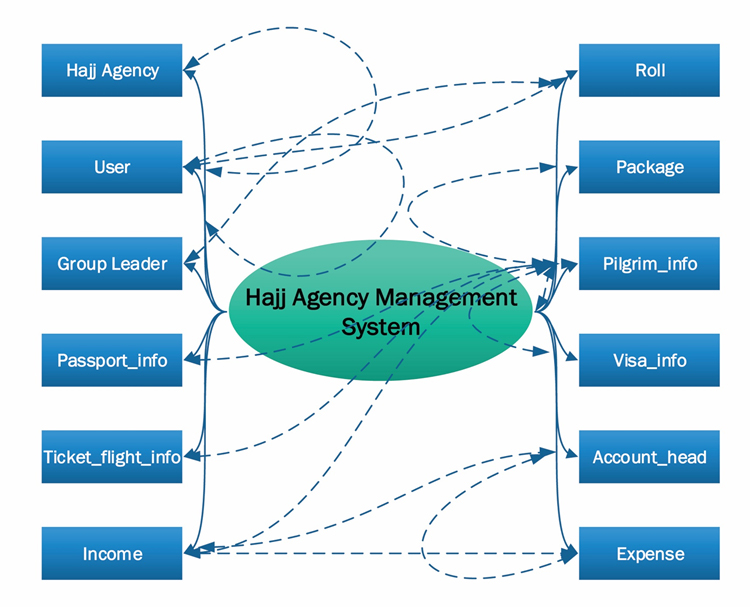
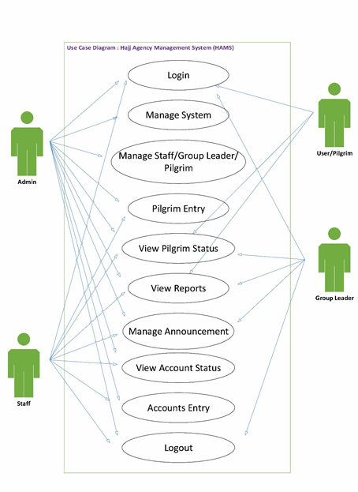
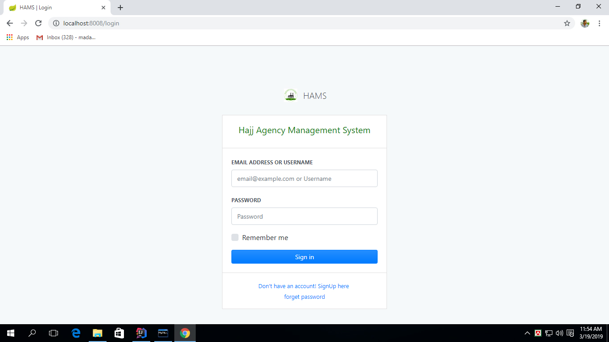
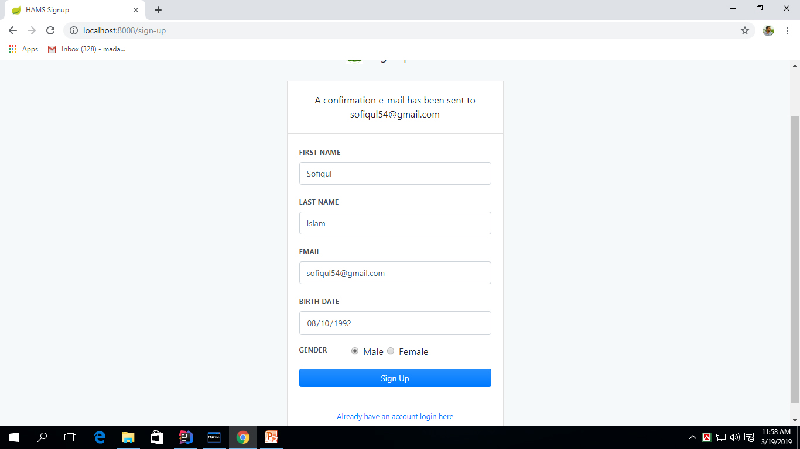
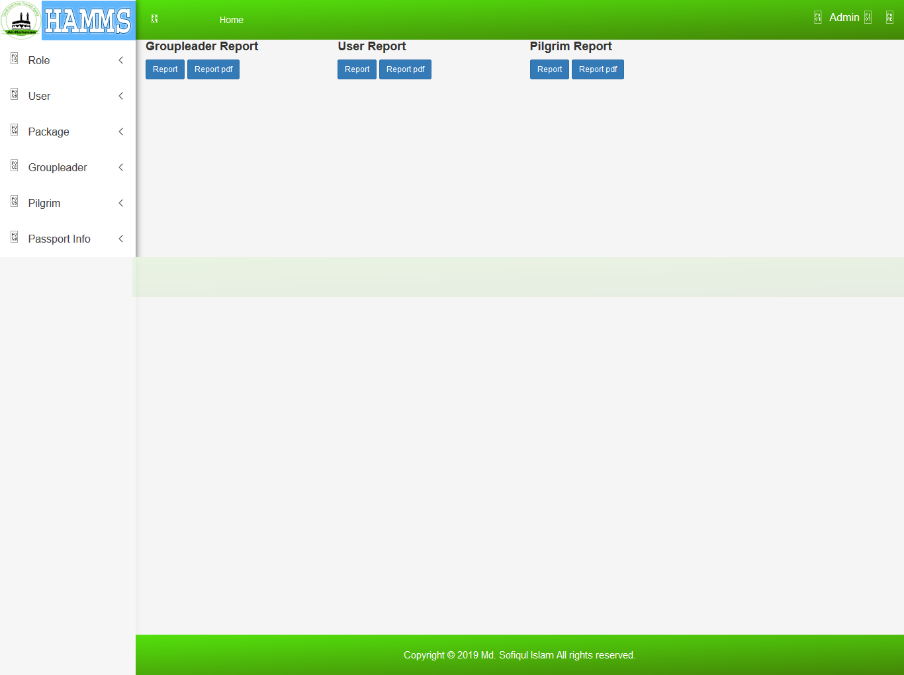

# Hajj Agency Management System (HAMS) 
A Complete Web Application on Hajj Agency Management System

## Core
- DevTools

# Spring Boot
- Web
- Security
- Mail
- Standalone
- Opinionated

# SQL
- MySql  
   1. Reliability
   2. Performance
   3. Ease of deployment
   4. Open source

- JPA
  1. Developer Productivity
  2. Database Independent
  3. Type and Parameter Handling
  4. Avoid Unnecessary Queries
  5. Caching

# Template Engines
- Thymeleaf

# REST API

# Images:
*Brainstroming Diagram*

*Usecase Diagram*

*Classdiagram*

*Login Form*

*Signup Form*

*Dashboard*

